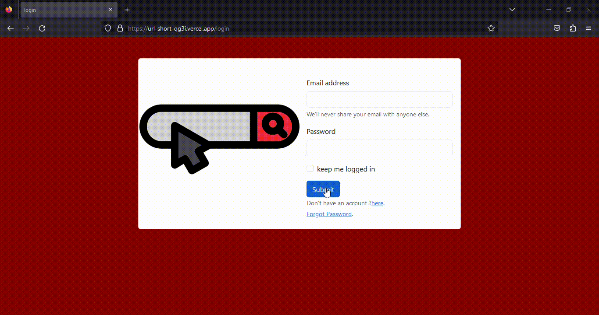
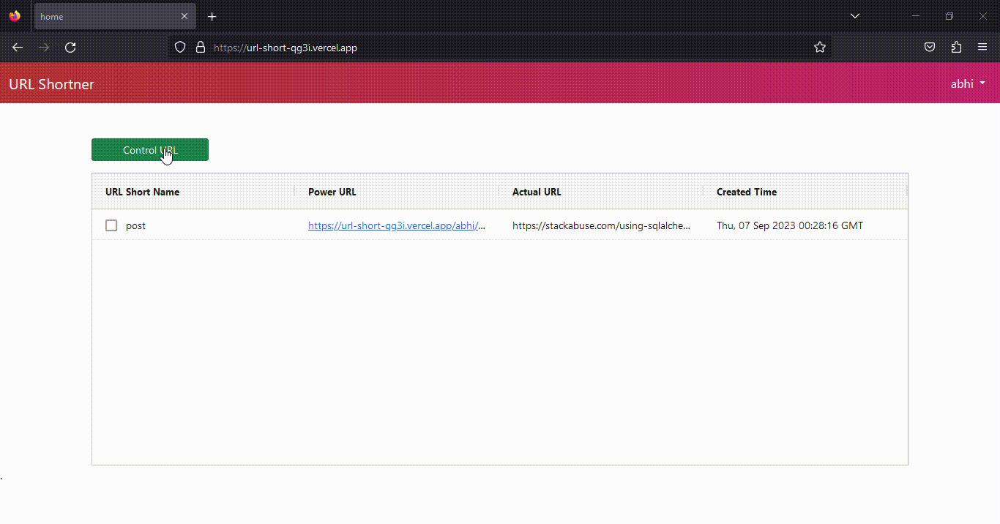
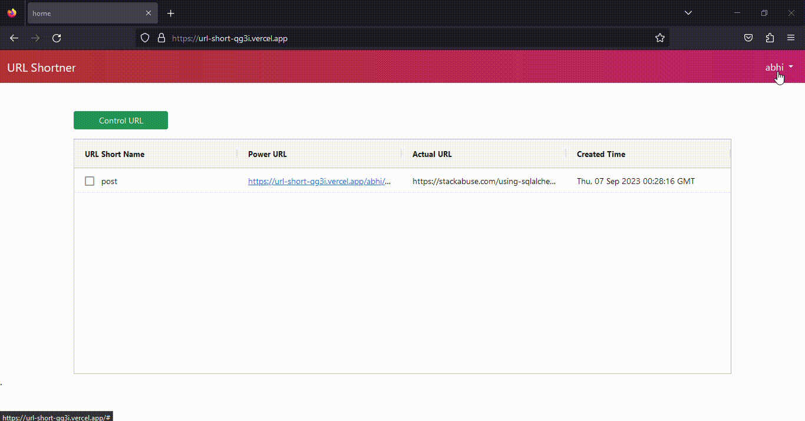

# Linky
## 🔧 Build With:
 
     

## 🛢️ Database Used:

## ☁️ Cloud Used:

## 🌐 Domain:

## What is a URL Shortener?
A URL shortener is a web service or tool that takes long and often complex URLs (Uniform Resource Locators) and replaces them with shorter, more manageable URLs. Clicking on this shortened link redirects the user to the original longer URL. The main purpose of URL shorteners is to make it easier to share links or make long, cumbersome URLs more user-friendly, especially on character-restricted platforms.

### Framework used:
<b>Bootstrap</b>: Bootstrap is a popular front-end framework used for web development, providing a set of pre-designed components and styles to streamline the process of building responsive websites.

<b>Flask</b>: Flask is a micro web framework for Python that is designed to be lightweight, simple, and easy to use. It was created with the goal of providing developers with the essential tools and features for building web applications without imposing a rigid structure or pre-defined components.

Flask is a minimalistic and flexible web framework for Python that empowers developers to build web applications with a high degree of control and simplicity. Its lightweight nature and extensibility make it suitable for a wide range of web development projects.

### Libraries used:

<b>Grid.js</b>: AG Grid Community is an open-source JavaScript library that provides powerful and useful information for web applications. It allows developers to create interactive databases with rich data and grids with features such as sorting, filtering, groups, and pages. Known for its performance and simplicity, the AG Grid Community allows users to handle large files and customize the look and behavior of the grid. It has powerful features yet is free to use, making it a popular choice for web developers.

<b>Ajax</b>: Ajax, short for asynchronous JavaScript and XML, is a web development method that facilitates the exchange of data between a web server and a web page without reloading the entire page. It does this by enabling partial updates, making web applications more dynamic and responsive, improving the user experience. It enables asynchronous communication using Ajax, JavaScript and data formats such as XML or JSON, facilitating real-time interactions and reducing the need for page refreshes.

## How It Works:

### Homepage:

### Scenario-1:

### Scenario-2:

### Scenario-3:

### Scenario-4:

### Scenario-5:

### Scenario-6:

## Summary:
This can be further developed with a few minor drawbacks to consider for future improvements.
 
